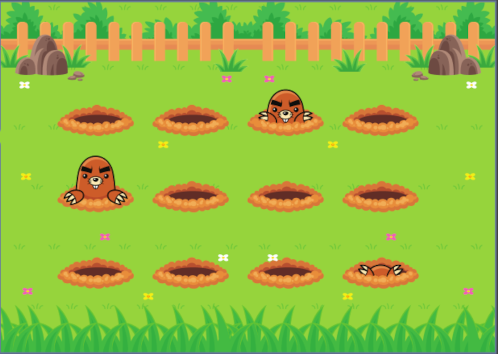

# explorer-desafio-das-toupeiras-stage03
 Uitlizar as animações keyframes para animar o jardim com as topeiras

  

## 🖥️ Projeto
Projeto construindo utilizando flex box e animações com o keyframes para animar um jardim com toupeiras aparecendo e sumindo de um buraco,
e desafio bastante desafiador mas no fim o projeto foi concluído com sucesso.

## 🚀 Tecnologias
Foi desenvolvido esse projeto no programa Explorer da Rocketseat no stage 03

- HTML
- CSS
- GIT
- GITHUB
- FIGMA

## 👁 View
Aqui você pode visualizar o layout do projeto
<a 
  href="https://www.figma.com/file/LbX5BO79ovoMDsSNuLEewn/Wack-a-Mole-(Community)-(Copy)?type=design&node-id=0-1&t=UUTKunLbXnHoQlkr-0" target="_blank">clique aqui</a>
